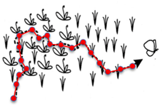

```{r setup, include=FALSE}
knitr::opts_chunk$set(echo = TRUE)
```

<a href="https://github.com/Smithsonian/Wildebeest_RSF.git" class="github-corner" aria-label="View source on GitHub"><svg width="80" height="80" viewBox="0 0 250 250" style="fill:#151513; color:#fff; position: absolute; top: 0; border: 0; right: 0;" aria-hidden="true"><path d="M0,0 L115,115 L130,115 L142,142 L250,250 L250,0 Z"></path><path d="M128.3,109.0 C113.8,99.7 119.0,89.6 119.0,89.6 C122.0,82.7 120.5,78.6 120.5,78.6 C119.2,72.0 123.4,76.3 123.4,76.3 C127.3,80.9 125.5,87.3 125.5,87.3 C122.9,97.6 130.6,101.9 134.4,103.2" fill="currentColor" style="transform-origin: 130px 106px;" class="octo-arm"></path><path d="M115.0,115.0 C114.9,115.1 118.7,116.5 119.8,115.4 L133.7,101.6 C136.9,99.2 139.9,98.4 142.2,98.6 C133.8,88.0 127.5,74.4 143.8,58.0 C148.5,53.4 154.0,51.2 159.7,51.0 C160.3,49.4 163.2,43.6 171.4,40.1 C171.4,40.1 176.1,42.5 178.8,56.2 C183.1,58.6 187.2,61.8 190.9,65.4 C194.5,69.0 197.7,73.2 200.1,77.6 C213.8,80.2 216.3,84.9 216.3,84.9 C212.7,93.1 206.9,96.0 205.4,96.6 C205.1,102.4 203.0,107.8 198.3,112.5 C181.9,128.9 168.3,122.5 157.7,114.1 C157.9,116.9 156.7,120.9 152.7,124.9 L141.0,136.5 C139.8,137.7 141.6,141.9 141.8,141.8 Z" fill="currentColor" class="octo-body"></path></svg></a><style>.github-corner:hover .octo-arm{animation:octocat-wave 560ms ease-in-out}@keyframes octocat-wave{0%,100%{transform:rotate(0)}20%,60%{transform:rotate(-25deg)}40%,80%{transform:rotate(10deg)}}@media (max-width:500px){.github-corner:hover .octo-arm{animation:none}.github-corner .octo-arm{animation:octocat-wave 560ms ease-in-out}}</style>

# Introduction
  >Example: White-bearded wildebeest (2010-2013)
  
We will use a dataset collected during my PhD field research in Kenya from 2010-2013.  These data are freely available on [Movebank](https://www.movebank.org/) and consist of 36 adult white-bearded wildebeest (*Connochaetes taurinus*) fitted with Lotek WildCell^TM^ GPS tracking devices and tracked across three separate and distinct ecosystems (Amboseli, Athi-Kaputiei Plains, and the Greater Mara).  Known to be particularly important to ecosystem function and diversity, many resident populations of wildebeest have become threatened with extinction over the past few decades.  The goal of this research was to understand how natural and anthropogenic change were affecting wildebeest.

These data can be referenced at:

Stabach JA, Hughey LF, Reid RS, Worden JS, Leimgruber P, Boone RB (2020) Data from: Comparison of movement strategies of three populations of white-bearded wildebeest. Movebank Data Repository. [doi:10.5441/001/1.h0t27719](https://www.datarepository.movebank.org/handle/10255/move.1095)

<div style="float:right">

</div>

In this excercise and those that follow, you will:

  * Import and clean an animal movement trajectory
  * Visualize the data and provide summary plots (and an animation) of the animal movements
  * Calculate an estimate of an animal's home range using the Continuous-Time Movement Modeling (CTMM) Framework
  * Perform a point-based resource selection function (RSF) analysis
  
# Initial Data Cleaning
Technological advancements over the past few decades have led to an exponential increase in the amount and quality of data collected on animals.  As an example, modern GPS units can now collect the position of animals, anywhere on the planet, with a precision of 2-10 meters.  In some cases, these data can be collected every hour, every minute, or even every second.  This, of course, means that these data are no longer independent, requiring advanced modeling techniques to analyze the data.

As a first step, we must first clean the data received before taking any additional advanced steps. This includes filtering the dataset for completeness, identifying duplicate records, removing invalid start or stop dates, and identifying positions of poor data quality.  Nearly all manufacturers report some type of positional quality, often reported as the type of position (e.g., 1D, 2D, or 3D) or Dilution of Position (DOP - horizontal or vertical).  Large DOPs indicate poor positional quality and can be easily filtered from the dataset.

## Load Libraries
Load the required libraries and remove everything held in [R's](https://cran.r-project.org/) memory.

```{r Clean Libraries, message=FALSE, warning=FALSE}
# Remove from memory
rm(list=ls())

# Load required libraries
library(adehabitatLT)
library(plyr)
library(dplyr)
library(ggplot2)
library(lubridate)
library(proj4)
```

## Set Time Zone
I prefer to keep items that require user input to appear at the top of my scripts.  For me, this is helpful when transitioning between different studies because most of this introductory code is essentially the same (especially between manufacturers), except for the time zone and local projection.  In this example, we will update UTC time to local time (Africa/Nairobi). 

```{r Clean Timezone}
# TimeZone and Projection
# Other timezones can be found at: https://en.wikipedia.org/wiki/List_of_tz_database_time_zones
Timezone1 <- "UTC"
Timezone2 <- "Africa/Nairobi" 
UTM36s.proj <- "+proj=utm +zone=36 +south +ellps=WGS84 +datum=WGS84 +units=m +no_defs" # EPSG:32736
LatLong.proj <- "+proj=longlat +ellps=WGS84 +datum=WGS84 +no_defs"  # EPSG:4326
```

## Load Collar Data
Load the `.csv` that I downloaded directly from [Movebank](https://www.movebank.org/).  These are my dissertation data that will be used for demonstration purposes.  Included with this file is a reference file (also downloaded from [Movebank]()), which contains additional details (sex, age) about each animal.  As described in class lectures, [Movebank]() is an excellent resource, with a variety of datasets that are freely available for research purposes.  Using [Movebank]() is advantageous for a number of reasons, one of which includes a standardized data structure, facilitating upload into a variety of [R](https://cran.r-project.org/) packages.

Most important is that any movement dataset included in analysis has the following variables:

1) Unique Animal ID
2) Time stamp
3) Coordinates (X/Y)

**NOTE**: If you open the file provided in Excel, do **NOT** save the file before loading it in [R](https://cran.r-project.org/). Excel will change the time stamp column and set it to the time on your computer - obviously not what you want for most studies.

```{r Clean Read}
# Read files in Data directory (Data File and Accessory File) - FILE IS NOT SPATIAL
wild <- read.csv("./Data/White-bearded wildebeest in Kenya.csv", header=TRUE)
wild.ref <- read.csv("./Data/White-bearded wildebeest in Kenya-reference-data.csv", header=TRUE)

# Look at the data and examine the data structure
#head(wild)
#str(wild)

#head(wild.ref)
#str(wild.ref)
```

## Dataframe Organization/Merge
Merge dataframe to include associated data and reorganize extra fields/columns

```{r Clean Merge}
# Re-organize fields and create new ID field (Not entirely necessary, but useful to remove the number of columns)
wild <- wild[,c(3:9,11,13:14)]

# Create an id field using the tag.local.identifier field
# Could also simply do: wild$id <- wild$tag.local.identifier, but then need to reorganize like we did above 
wild <- wild %>% 
  mutate(id = tag.local.identifier) %>% 
  relocate(id)
#head(wild)

# Look at dataframes
#str(wild)
#str(wild.ref)

# Grab the fields you are interested in merge (easist way)
# Merge the two datasets together (also see join in dplyr...lot's of options), including age, sex, and study study site from db2
wild.ref <- wild.ref[,c(1,4:5,7:8,17)]
wild <- merge(x= wild, y = wild.ref, by.x = "id", by.y = "tag.id", all.x = TRUE)
#head(wild)
```

## Time Zone Formatting
There are a number of issues that must be corrected with most movement datasets upon import into [R](https://cran.r-project.org/).  Most importantly, this includes the time field.  Here, the time field is a character field.  We must convert this to a date field that [R](https://cran.r-project.org/) recognizes properly.  Setting a time zone can be frustrating, but many packages (e.g., [lubridate](https://cran.r-project.org/web/packages/lubridate/index.html)) make things much easier.  Please review the `help` file for the [strptime](https://www.rdocumentation.org/packages/base/versions/3.6.2/topics/strptime) package to format your date/time field. Note the format of **YOUR** own dataset (e.g., "%Y-%m-%d %H:%M:%S").

```{r Clean TimeZone}
# Look at the timestamp
#str(wild$timestamp)
wild$timestamp[1:10] # Character

# Format the timestamp from Timezone1 (UTC) to Timezone2 (EAT)
# Note that I have overwritten the timestamp field here, recorded initially in GMT/UTC (time zone/time standard)
wild$timestamp <- as.POSIXct(wild$timestamp, format = "%Y-%m-%d %H:%M:%S", tz=Timezone1) # Note the format, which is dependent on YOUR data
attr(wild$timestamp, "tzone")
wild$timestamp <- with_tz(wild$timestamp, tz=Timezone2) # Again, see: https://en.wikipedia.org/wiki/List_of_tz_database_time_zones
attr(wild$timestamp, "tzone")

# Look at the timestamp
wild$timestamp[1:10]

# Some additional examples for manipulating the time field, include:
# ****************************************
# ****************************************

# Example 1 (same as above, but using the lubridate package and piping):
# **********
#wild$ts2 <- ymd_hms(wild$study.local.timestamp, tz = Timezone2) # This is the really important step, because you need to properly capture the format
#head(wild$ts2)
# If wanted to change back to UTC
#wild$ts2 <- with_tz(wild$ts2, tz = Timezone1)
#head(wild$ts2)

# Or using piping and the dplyr package, you can do this in 1 step
# wild <- wild %>% mutate(tsEAT = ymd_hms(study.local.timestamp, tz = Timezone2), tsUTC = with_tz(tsEAT, tz = Timezone1))
# head(wild)

# Example 2 (Date and Time fields are in different columns):
# **********
# Fields must first be appended (use paste0 or lubridate).
# day <- c("2021-03-15", "2021-03-16", "2021-03-17", "2021-03-18", "2021-03-19")
# time <- c("06:02:01", "09:01:00", "12:00:00", "15:03:00", "18:01:01")
# test.data <- cbind.data.frame(day,time)
# test.data

# Using paste0
# test.data$timestamp <- as.POSIXct(paste0(test.data$day," ", 
#                                          test.data$time), 
#                                   format = "%Y-%m-%d %H:%M:%S", tz = Timezone1)
# test.data$timestamp

# Using lubridate
# test.data$timestamp2 <- as.POSIXct(lubridate::ymd(test.data$day) +
#                                      lubridate::hms(test.data$time), tz = Timezone1)
# test.data#timestamp2

# One other good hint:
# Use 'force_tz' to "Force" the zone without changing the actual clock time.
```

# Completeness & Duplicates
Now that you have added appropriate timestamps, we can do a final check of the completeness of the dataset, making sure that all records have an ID, timestamp, and coordinates.  If you are downloading a dataset from [Movebank](), the data are likely pretty clean, but still good to check.  Also common with GPS datasets is for points to be duplicated or near duplicated (two or more positions collected just a few seconds apart).

## Missing Data
Movement datasets often include missing data.  Device will often attempt to collect or send a fix, but may be unable to connect to the satellite constellation (e.g., Navstar and/or Iridium constellation). In other cases, the collar may experience a device failure. Common is for records to be included in the data output with no Lat/Long coordinates. In all cases, these data must be filtered from the dataset.

```{r Missing Final}
# Determine if any missing data
# In this particular clase, we're not expecting any NA values, since the data have been clean and uploaded from Movebank
if(all(complete.cases(wild)) == T){print("All Looking Good. No issues found")} else {
  print("!!! Dallas, We Have a Problem !!!")
  # Remove NA rows
  nrow(wild)
  wild <- wild[complete.cases(wild[,c("id","location.lat","location.long","timestamp")]),]
  nrow(wild)
  }
```

## Duplicated Data Points
GPS devices also tend to collect duplicate data points that need to be removed.  Sometimes, points will also be "near" duplicates (i.e., points that are a few seconds apart when they should be and hour or or more apart).  Both issues need to be addressed.  We'll start with removing exact duplicates from the dataframe here and remove near duplicates when we calculate a 2D trajectory.

```{r Duplicated Final}
# Duplicate timestamps:
if(anyDuplicated(wild[,c("id","timestamp")]) == F){print("No Duplicates found")} else {
  
  # Remove Duplicates
  print(paste0("Initial Number of Records in Dataset: ",nrow(wild)))
  print("Removing Duplicates")
  wild  <-  wild[!duplicated(wild[c('id', 'timestamp')]),] # or wild <- wild %>% distinct(id, timestamp)
  print(paste0("Number of Records after NA's removed: ",nrow(wild)))
}
```

## Invalid Start/Stop Dates
Lastly, it is also common for data to be collected on the device prior to device fitting or after the animal has died.  Sometimes you may want to retain these data (i.e., to validate the GPS error), but you certainly want to remove them from further analysis on the animals' movement.  Many studies have shown that the first 1-3 days (e.g., [Northrup et al. 2014](https://wildlife.onlinelibrary.wiley.com/doi/10.1002/jwmg.705) of GPS data should be removed from movement datasets to remove capture-based effects.  We will do so here with the reference data included with the dataset.  Sometimes, however, erroneous data points are only identified by plotting the data, a process we will do next.

```{r Different Start Dates}
# Use the deploy.on/off dates in the dataframe to subset the data.
# Convert character field to a date field
wild$deploy.on.date <- ymd_hms(wild$deploy.on.date)
wild$deploy.off.date <- ymd_hms(wild$deploy.off.date)

# Based on Northrup et al, let's update the deploy.on.date + 1 day. 
# Alternatively, you could load in a dataframe with dates/times that you want to subset your dataframe
unique(wild$deploy.on.date)
wild$deploy.on.date <- wild$deploy.on.date+ days(1)
unique(wild$deploy.on.date)

# We can now use these dates to query the database
# There maybe a simpler way to do this, but I usually use a simple loop here, executing a date query on each animal.

# Create Unique ID
Un.ID <- unique(wild$id)

# Create Null Dataframe to store results
MyAnimals <- NULL

# Loop over each animal
for(i in 1:length(Un.ID)){
  # Subset by animal
  #temp <- subset(wild, id == Un.ID[i])
  temp <- wild[wild$id==Un.ID[i],] # This is simply a different way to subset or filter
  
  # Grab the unique Deploy.on.Date
  New.Start <- unique(temp$deploy.on.date)
  
  # Subset by Un.Start
  temp <- subset(temp, timestamp >= New.Start) # Add & clause if want to also subset by deploy.off.date (e.g., (timestamp >= New.Start & timestemp < New.End))
  
  # Bind the subset together
  MyAnimals <- rbind(MyAnimals, temp)
}

nrow(wild)
wild <- MyAnimals # Overwriting initial dataset
rm(MyAnimals) # Remove unneeded dataframe
nrow(wild)

# Remove unwanted Deploy Date columns
#head(wild)
wild <- wild[,-(12:13)]
```

# Data Quality & Summary
Nearly all telemetry datasets have some sort of data quality flag included with the recorded positions. Since every manufacturer has different ways to report error, you'll have to familiarize yourself with your own dataset.  For example, some manufacturers report SPS (Standard Positioning System) or DGPS (Differential GPS) positions, while others report a measure of the type of positions (e.g., 1D, 2D, 3D).  Best is when manufacturers report a Dilution of Precision (DOP).  In this last step, we'll assess DOP and then create a 2D trajectory to summarize and graph results.  

## Dilution of Precision (DOP)
Lotek GPS collars (what we're using here) are provided with a DOP measure.  While the data have already been cleaned prior to import into [Movebank](), these steps can be adapted to other datasets and are potentially useful to remove poor quality data points.  Colleagues at the Smithsonian (Fleming et al. in review) are also working on methods to fit a model to the error structure of the data and correct for potential problems.  We recommend placing your GPS device in an open constellation before fitting collars on your animals, to providing the validation data required to assess GPS error/scattering.  Here, we'll show a very basic way of filtering poor quality data points.

```{r Summary Load Data}
# Plot the DOP values for confirmation.
# For this dataset, the included identifying whether the position was 2D or 3D and then using a qualitative measure to remove poor positions
# I was more restrictive on 2D positions (gps.dop < 5.0)

# Example: 
nrow(wild)
hist(wild$gps.dop, xlab="DOP", ylab="Frequency", main="Wildebeest GPS Data")

wild <- subset(wild, gps.fix.type.raw == "3D" & gps.dop < 10.0 | gps.fix.type.raw == "2D" & gps.dop < 5.0) # This doesn't do anything here because I already filtered the data

hist(wild$gps.dop, xlab="DOP", ylab="Frequency", main="Wildebeest GPS Data")
nrow(wild)
# Important to inspect your own dataset to understand the fields included
```

## Create Trajectory
Many [R]() packages exist to create a movement trajectories.  This includes [AdehabitatLT](https://cran.r-project.org/web/packages/adehabitatLT/index.html), [move](https://cran.r-project.org/web/packages/move/index.html), and [amt](https://cran.r-project.org/web/packages/amt/index.html).  Here, we will use [adehabitatLT]() to generate a trajectory and then summarize the movements of each animal, converting the spatial object from Lat/Long to UTM 36S WGS84.  This is essential to calculate distance between steps.  Importantly, we need to "regularize" the trajectory, filling in a NULL record where a point should have been collected but was missed.

```{r Create Trajectory}
# Create matrix
temp <-as.matrix(cbind(wild$location.long,wild$location.lat))

# Project to UTM 36S (projection specified above) or other meter projection
xy <- project(temp, UTM36s.proj) # This uses the proj4 package (Spatial Points File)
#plot(xy)

# Use the as.ltraj function to create individual animal trajectories. Use the infolocs command to included attributes of the dataframe.  
# Automatically calculates the distance between succesive locations, relative and absolute turning angles (in radians), and the time interval between successive locations (in seconds)
traj.raw <-as.ltraj(xy, date = wild$timestamp,id = wild$id, typeII = TRUE, infolocs = wild[3:14], slsp = c("remove"))

# This is a list of objects
# To view individual aniamls
head(traj.raw[[1]])

# Notice that the dataset has no NAs.  This is because the function doesn't recognize the movement interval, something we must set.
# In our case, the data were collected: Every hour from 6 am to 6 pm and Every three hours from 6 pm to 6 am
# For the remainder of our exercises, we will treat these data as a 3 hour dataset

# Create a reference date and use setNA to re-run trajectory
refda <- strptime("00:00", "%H:%M", tz=Timezone2)

# Create NA values and make a regular trajectory based on refda
traj.NA <- setNA(traj.raw, refda, 3, units = "hour") 
traj.reg <- sett0(traj.NA, refda, 3, units = "hour")
#is.regular(traj.reg)

# Summarize Trajectory
Summary.traj <- summary(traj.reg)

# Add details to the summary
Summary.traj <- Summary.traj %>% mutate(
  DaysTrack = signif(difftime(date.end,date.begin, units="days"),digits=2),
  Records = nb.reloc-NAs,
  PctComplete = signif((nb.reloc-NAs)/nb.reloc*100,digits=4),
)

# Look at
Summary.traj

# Convert trajectory with movement statistics to a dataframe
wild.df <-ld(traj.reg)

# Calculate basic movement statistics.  This are just some initial statistics
# REMEMBER: this is a 3 hour data.  Therefore, movements are simply based on the linear steps.
Mvmt.Statistics <- ddply(wild.df,"id", summarise,
              AvgMove = round(mean(dist/1000,na.rm=TRUE),digits=2), # Convert to km
              SumMove = round(sum(dist/1000,na.rm=TRUE),digits=2), # Convert to km
              MaxDisp=round(max(sqrt(R2n)/1000,na.rm=TRUE),digits=2)) # Convert to km
Mvmt.Statistics
```

## Visualize Movement Patterns
[Adehabitat]() has a number of plotting options.  I use these sometimes, but usually prefer to create my own plots from the variables created using the [Adehabitat]() functions.  Here, I provide a simple example of a movement trajectory, with a "for loop" to plot each animal.  I find the net squared displacement plots and steplengths to be interesting to look at, helping to identifying potential outliers and/or errors in the data.  These plots can also be helpful in informing potential research questions.

```{r Visualize}
# Plot trajectory using adehabitat object (list)
plot(traj.reg[1]) # Or plot(traj.wild) to view all animals

# We can also look at the DOP over time or the how the data were collected (every X minutes)
plotltr(traj.reg[1], "gps.dop") # Graphic of DOP over time......these should all be < 10, since we've cleaned them above
#plotltr(traj.reg[1],"dt/60") 

# My preference is to create a custom plot
# Setup a plotting layout with three panels
layout(matrix(c(1,1,2,3), 2, 2, byrow = FALSE), widths=1, heights=c(1,1))

# Here, we will "loop" over every individuals (by id)
Id.val <- unique(wild.df$id)

#for (i in 1:length(Id.val)){  # Uncomment out
i <- 1 ###### Remove to loop over all animals
# ****************************** 

  # Remove the NAs and subset to id == Id.val[i]
  wild.sub <- subset(wild.df[!is.na(wild.df$x),], id == Id.val[i]) # This is just to account for NAs that have been added from as.ltraj function
  
  # Calculate the total days tracked
  time.diff <- trunc(difftime(format(wild.sub$date[1],tz=Timezone2),format(wild.sub$date[nrow(wild.sub)],tz=Timezone2),units="days"))
  
  # Plot the trajectory
  plot(wild.sub$x,wild.sub$y,typ="l",xlab="Easting",ylab="Northing",main=paste0(wild.sub$id[1]," Movement"),frame=FALSE,axes=FALSE,asp=1)
     mtext(paste0(format(wild.sub$date[1],"%Y-%m-%d")," to ",format(wild.sub$date[nrow(wild.sub)],"%Y-%m-%d")),cex=0.75)
     axis(1, labels=TRUE)
     axis(2, labels=TRUE)
  points(wild.sub$x,wild.sub$y,pch=16,cex=0.5,col="blue")
  points(wild.sub$x[1],wild.sub$y[1],pch=17,cex=1,col="green")
  points(wild.sub$x[nrow(wild.sub)],wild.sub$y[nrow(wild.sub)],pch=15,cex=1,col="red")
  
  # Plot the movements over time (Velocity)
  plot(wild.sub$date, wild.sub$dist/1000, type='l', ylab="Distance moved (km)", xlab="Time", main="Steplengths", frame=FALSE)
    # Calculate the time from release date	
    mtext(paste0(abs(time.diff)," days"),cex=0.75)
  
  # Plot the net displacement per step
  plot(wild.sub$date, sqrt(wild.sub$R2n)/1000, type='l', ylab="Distance (km)", xlab="Days Since Release", main="Net Displacement",frame=FALSE)
    mtext(paste0(abs(time.diff)," days"),cex=0.75)
#} # Uncomment
```

# Subset & Export
For our next exercises, we will incorporate a subset of the dataset we cleaned above (the non-trajectory dataset).  This has a Lat/Long coordinates reference system.  We will subset the data to the Maasai Mara and save as a `.Rdata` file.

```{r Clean Export}
# Filter the data to the Mara region for analysis
wild.Mara <- wild %>% filter(
  study.site == "Mara")

wild.Athi <- wild %>% filter(
  study.site == "Athi-Kaputiei Plains")

# How many animals are included in the dataframe?  Should be 15.
length(unique(wild.Mara$id))
length(unique(wild.Athi$id))

# Save file to your Data directory for subsequent analyses
#save(wild.Mara, wild.Athi, file = "./Data/wild.Rdata")
```